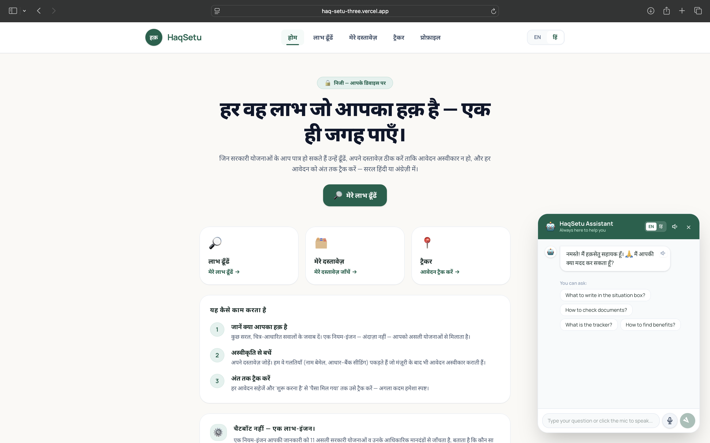
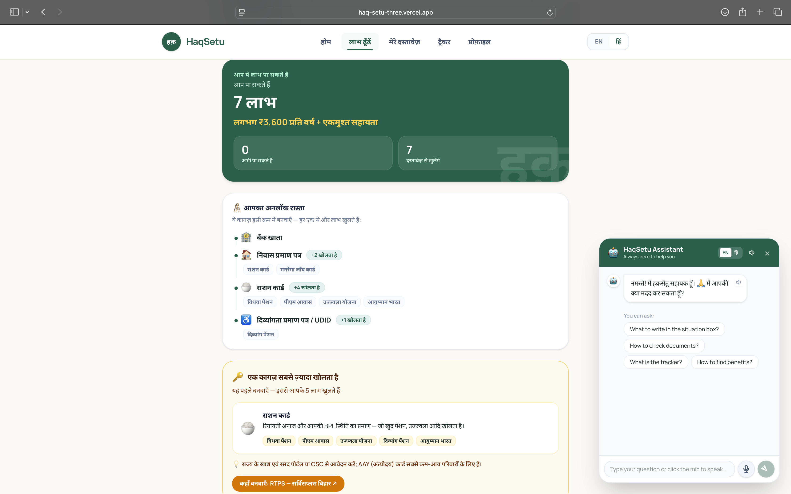
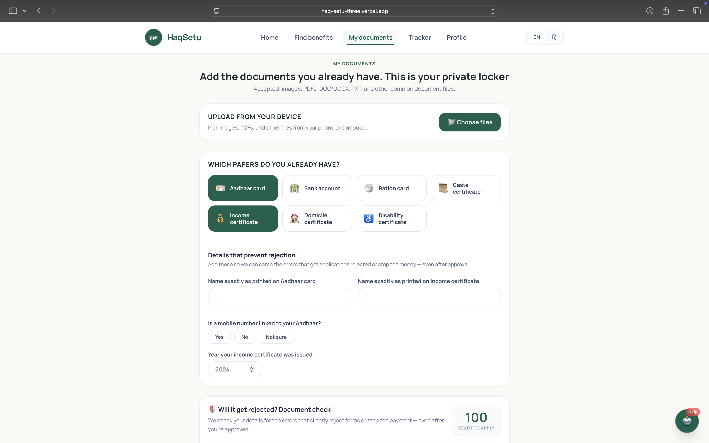

# HaqSetu — हक़सेतु

**The benefits you are owed: found, explained, and claimed.**

USAII Global AI Hackathon 2026 · Undergraduate Track · Challenge 4 ("Fix Systems People Depend On") · Direction A: Benefits Navigator

Live demo: https://haq-setu-three.vercel.app

HaqSetu is an AI-powered, privacy-first, bilingual web app that helps low-income Indian families find the government welfare schemes they may be entitled to, fix the paperwork mistakes that get applications rejected, and follow each claim until the money actually arrives — in plain Hindi or English. An AI-powered assistant is always one tap away, and opens on its own to offer help if someone has been stuck on a screen for a couple of minutes.

---

## Try it in two minutes

You can use the deployed app or run it locally. Either way, sign in with the demo account below. It needs no real phone or SMS, and everything you enter stays in your own browser.

**Demo login**

- Phone number: `+91 9999888800`
- OTP: `543210`

After the OTP, enter a name, age, and state to create the local profile. Then walk through the three working sections:

1. **Find benefits** — load one of the sample people, or answer a couple of questions. You will see the schemes you may qualify for, an estimated yearly value, and the order in which to collect documents.
2. **My documents** — tick the papers you already have and fill in the name, Aadhaar, and income fields. The page runs a rejection check and returns a readiness score with the exact fix for each problem.
3. **Tracker** — move an application through its stages, from "to start" to "money received".

Nothing is sent to a server. The demo profile lives only in `localStorage` on your device; logging out clears it.

### Running locally

```bash
npm install
npm run dev                      # http://localhost:3000
npx tsx scripts/test-engine.ts   # rules-engine self-test across the sample people
```

The language features (free-text intake and the plain-language explanation) use Google Gemini. To enable them, add a `.env.local` file with `GEMINI_API_KEY=...` (and optionally `GEMINI_MODEL=gemini-2.5-flash`). The app works without a key: intake falls back to a local keyword parser and the explanation to a fixed template, so the rules engine and the demo never break.

---

## Screenshots

<p align="center">
  
  <br /><sub><b>Home</b> — the four sections and a plain-language assistant, in Hindi or English.</sub>
</p>

<p align="center">
  
  <br /><sub><b>Find benefits</b> — schemes you may qualify for, an estimated yearly value, and the single document that unlocks the most.</sub>
</p>

<p align="center">
  
  <br /><sub><b>My documents</b> — a private local locker plus a rejection check that scores how ready an application is and lists the fixes.</sub>
</p>

---

## The problem

India runs one of the world's largest welfare systems — more than 800 million eligible citizens and an annual budget above 210 billion dollars — yet a large share of those benefits never reaches the people they are meant for. The reason is rarely that people do not want them. It is that the system is confusing, spread across many departments, and gated behind paperwork that is easy to get wrong.

Three failures show up again and again in field research:

- **The documentation trap.** Around a fifth of benefit exclusion is purely a paperwork problem. In one Jharkhand district, more than 80 percent of Dalit and OBC families had no caste certificate, which meant they could apply for none of the schemes meant for them. One missing paper, often Aadhaar, quietly blocks several benefits at once; getting it unlocks them together.
- **The awareness gap.** Eligible people simply do not know what they qualify for. About two-thirds of eligible widows in Delhi never claim their pension, mostly for lack of information.
- **Silent failure after approval.** Roughly 8 to 12 percent of already-approved scholarships are never paid out, because of a name that is spelled differently across documents, an Aadhaar number not linked to the bank account for direct transfer, or an invalid IFSC code. The "yes" comes through and the money still does not.

Add low literacy, language barriers, the digital divide, and middlemen who charge for things that are free, and the gap becomes structural. Organisations like Haqdarshak, Code for America, and Benefits Data Trust have shown this gap can be closed with a mix of technology and human help. HaqSetu is built in that spirit.

## What HaqSetu does

One local profile, entered once, flows through four connected pages:

- **Home** explains the flow and the privacy promise, and links to each section.
- **Find benefits** matches the person against real schemes — NSAP pensions (old-age, widow, disability), NFSA ration, PM-KISAN, PMAY-G housing, Ayushman Bharat PM-JAY, PM Ujjwala, the Post-Matric Scholarship, PMMVY maternity support, and MGNREGA — each with an honest "you may be eligible" verdict and a cited reason.
- **My documents** is a local locker plus a rejection check. Before a person applies, it reviews their specific documents for the errors that silently sink applications: a name spelled differently across Aadhaar, bank, and certificate; Aadhaar not seeded to the bank for direct transfer; a dormant account; an invalid IFSC; a stale income certificate; an OBC certificate not marked non-creamy-layer. It returns a readiness score and the exact fix for each issue.
- **Tracker** follows each application from "to start" through "applied", "under verification", "approved", and "money received", keeping the next step clear.

A small **AI-powered assistant** sits in the corner of every page for anyone who gets stuck. It answers questions about the schemes, the documents, and how to use the app, in Hindi or English, and can read its replies aloud. If a person has not touched the screen for a couple of minutes — often a sign they are confused — it opens by itself and offers a hand, instead of waiting to be found.

Throughout, the app shows a running estimate — "you may be entitled to about X rupees a year, plus one-time help" — to turn an abstract maze into a concrete, motivating number, and it points to free human help at a Gram Panchayat or Common Service Centre.

## How it works

The defining decision is what the software is allowed to decide on its own, and what it is not.

```
Person's words  ->  language model structures  ->  rules engine decides (cited)  ->  language model explains  ->  person confirms and verifies
```

- A **deterministic, unit-tested rules engine** (`lib/rules/`) owns every eligibility verdict. Income ceilings, BPL and age gates, and scheme criteria are precise facts, so a language model is never allowed to decide them.
- **Adaptive intake** (`lib/rules/inquiry.ts`) chooses the next question by value of information: for each thing it does not yet know, it tests how the answer would change the result, and asks the single most useful question next. The long form becomes optional.
- An **entitlement dependency graph** (`lib/rules/graph.ts`) models schemes, the documents they need, and the documents those documents need. Walking it in order produces the best unlock path — which paper to get first, and what each one opens — and a coverage gap showing how many benefits can be claimed now versus how many are blocked.
- The **rejection check** (`lib/rules/validation.ts`) is exact and repeatable: it always checks name consistency, Aadhaar-to-bank seeding, IFSC format, certificate recency, and non-creamy-layer status.
- The engine runs **in the browser**, so the profile and documents never need to be sent anywhere. The only outbound calls are the optional Gemini intake and explanation, which receive typed text or a short de-identified summary — never ID numbers or document contents — and only after consent.
- Everything user-facing is written by the team in both **English and Hindi**, so the chosen language is consistent from the first screen to the printed plan. The model only translates its own free-text restatement.

## Why not just ask a chatbot

A capable language model can reason about a scheme and even sketch the document dependencies, so general eligibility advice is no longer scarce. HaqSetu's value is the part a conversation cannot be:

- **It is a record, not a chat.** The profile is captured once as structured data and reused across every scheme and every visit. A chat forgets the person when the tab closes.
- **It runs the same exact audit every time.** The rejection check is repeatable and exhaustive. A model mentions these errors only if asked, phrases them differently each time, and can invent an IFSC or skip the seeding step. These are the errors that lose money after the application has already been approved.
- **It produces something to act on**, not prose: a printable plan to hand to a Common Service Centre operator, filled from data the person confirmed.
- **It is built for someone who cannot prompt** — icon-led intake, full Hindi, works without an API key, and routes to free human help. The people losing benefits are exactly the ones who would never open a chatbot.

Take the language model away and HaqSetu still works, on local parsing and templated explanations. Take the engine away and it is just a chatbot.

## Submission details

**AI Architecture.** A free-text situation (Hindi or English) and a structured profile (community, age, gender, household income, BPL status, occupation or land, disability, household flags, and documents already held) go in. The model extracts fields and writes the final explanation; in between, a deterministic engine matches the person to cited schemes and computes which missing document unlocks the most benefits. Out comes a list of schemes with verdicts and reasons, the unlock card, an estimated annual value, and a sequenced action plan with where to get free help.

**Human-in-the-Loop.** The software does not approve benefits or issue certificates. Those are decided by the Gram Panchayat, the issuing officer, or the scheme authority, who verify documents and are accountable. HaqSetu only surfaces what a person may be entitled to and routes them to a human to confirm. Every field the model extracts is shown for the person to correct before anything is assessed.

**Responsible AI Guardrail.** The risk is false confidence: telling a poor family they do or do not qualify and being wrong has real consequences. Mitigations: strict "may be eligible" framing; the model is structurally barred from deciding eligibility or inventing numbers; every rule shows a dated public source; "needs more info" and "worth checking" states replace false negatives; and poor-friendly alternatives (self-declaration, Jan Dhan accounts, introducer-based Aadhaar) are surfaced so people are not wrongly turned away.

**Tools Used.** Next.js, React, TypeScript, and Tailwind CSS (free and open source). Google Gemini API (`gemini-2.5-flash`, free tier) for the optional language features. AI coding assistance: Claude Code (disclosed).

**Data Disclosure.** Only publicly available government scheme rules (NSAP, NFSA, PM-KISAN, PMAY-G, PM-JAY, PM Ujjwala, the National Scholarship Portal, PMMVY, MGNREGA, UIDAI and PMJDY) and reputable public research on welfare exclusion (Haqdarshak field studies, IDinsight, CAG), plus synthetic personas created by the team. No real personal data or government databases are accessed. Scheme values are researched approximations, each dated and flagged for verification.

## Scope and limitations

- The document and certificate process is detailed for Rajasthan and Bihar, with a generic central fallback; eleven major central schemes are modelled. The coverage is intentionally narrow and transparent, because state schemes and exact thresholds vary and change.
- Scheme values are researched figures and are dated; always confirm at a Gram Panchayat or Common Service Centre. This caution is part of the product's point, not a footnote.
- The tool cannot verify whether self-reported facts are true.
- Sign-in uses a local demo account for the hackathon. Real phone OTP would require a paid SMS provider; the demo number above stands in for it and keeps all data on the device.

## Project map

```
app/page.tsx              Home — explainer, privacy promise, section entry points
app/schemes/page.tsx      Find benefits — intake and results, engine runs on-device
app/documents/page.tsx    My documents — local locker plus the rejection check
app/tracker/page.tsx      Tracker — application status from start to money received
app/profile/page.tsx      Profile — local profile, editable, stored in the browser
components/AuthGate.tsx    Sign-in gate and onboarding (includes the demo account)
components/HelpBot.tsx     AI assistant: answers questions, reads aloud, auto-opens when idle
components/shared.tsx      Navigation and bilingual UI and result components
lib/store.ts              localStorage hooks (profile, tracked apps, AI consent)
lib/i18n.ts               Bilingual UI dictionary
app/api/parse/route.ts    Optional intake: free text to structured profile (Gemini)
app/api/explain/route.ts  Optional plain-language summary of an on-device result (Gemini)
app/api/chat/route.ts     AI assistant backend (Gemini) for the help bot
lib/rules/schemes.ts      Eleven welfare schemes with deterministic eligibility logic
lib/rules/documents.ts    Foundational documents, prerequisites, poor-friendly alternatives
lib/rules/inquiry.ts      Adaptive intake: value-of-information next-question selection
lib/rules/graph.ts        Entitlement graph: unlock path and coverage gap
lib/rules/validation.ts   Rejection check (name, seeding, IFSC, recency, NCL) and score
lib/rules/engine.ts       Scheme matching, documentation trap, value estimate, action plan
lib/rules/citations.ts    The dated public source for every rule and statistic
lib/personas.ts           Five synthetic sample people
```
